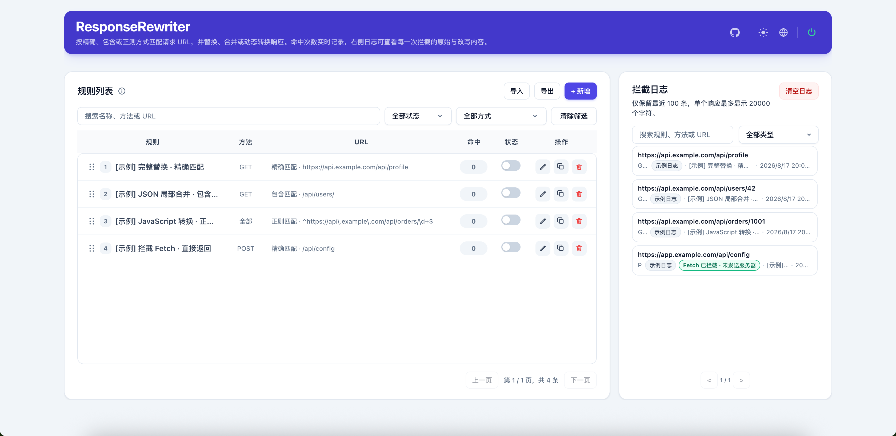
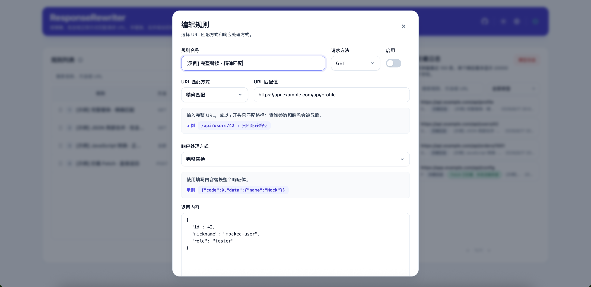
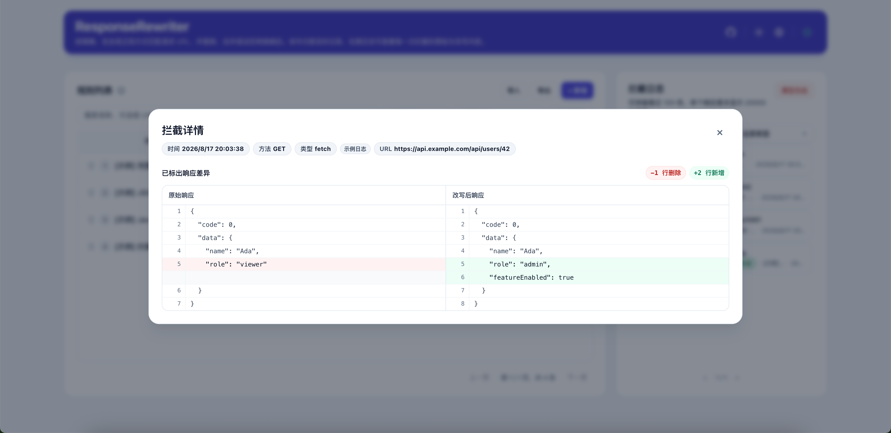
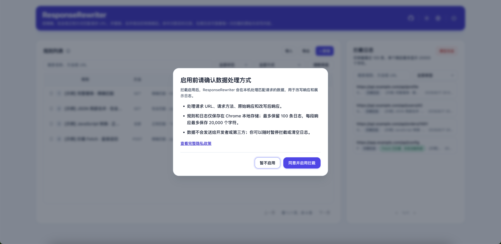

# ResponseRewriter

<p align="center">
  
</p>

<p align="center">
  <strong>A Chrome extension that lets you intercept and rewrite XHR / Fetch responses — no backend changes, no mock server needed.</strong>
</p>

<p align="center">
  
  
  
  <a href="./README.md">简体中文</a>
</p>

---

## Ever found yourself here?

| Problem | The usual workaround | With ResponseRewriter |
|---|---|---|
| Backend API is down, frontend work is blocked | Wait for the backend to recover | Create a rule, return fake data, keep building |
| Need to test what happens when a field changes | Edit backend code, redeploy, repeat | Type a JSON snippet, refresh the page, done |
| Production bug needs a temporary response fix | Hotfix cycle with review and deploy | Write a regex rule, transform on the fly, turn it off anytime |
| Want to see if edge-case data breaks the UI | Seed the database with synthetic records | Override one field and verify instantly |
| Not sure what a request actually returned | Switch to DevTools, dig through Network tab | Every interception logged right there with original vs. rewritten diff |

**In short: you take control of what the page sees.**

---

## Why this instead of Postman Mock / Charles / Whistle / …

- **No tab-switching** — stay on the page you're debugging. No proxy config, no hosts file, no separate mock server
- **Page-native interception** — hooks into the page's own `XMLHttpRequest` and `fetch`. The page code can't tell the difference
- **Fetch can skip the network entirely** — mock mode intercepts `fetch()` before it hits the wire, so it never appears in DevTools Network
- **Rules are JSON** — export, import, version-control, share with teammates. One file captures your entire mock setup
- **Every hit is recorded** — original vs. rewritten side-by-side diff so you always know what changed

---

## Quick Start

<p align="center">
  <em>First rule in 30 seconds, takes effect on the next page refresh</em>
</p>

```bash
# 1. Clone
git clone https://github.com/FutaoSmile/ResponseRewriter.git

# 2. Open chrome://extensions/ → Enable Developer mode → Load unpacked → Select the project folder

# 3. Click the extension icon to open the manager and start creating rules
```

First install initializes four disabled example rules plus four example logs, covering every match mode and processing mode. You can explore how everything works without writing a thing.

---

## Screenshots

**Rule list** — the manager's main screen: create / edit / delete rules, toggle them on or off, drag to reorder, and see hit counts at a glance.

<p align="center">
  
</p>

**Add / edit rule** — pick a URL match mode and a response processing mode, with the JSON edited right in the dialog.

<p align="center">
  
</p>

**Interception detail** — expand any hit to see an original → rewritten line-by-line diff with auto-formatted JSON.

<p align="center">
  
</p>

**Data processing consent** — before interception is enabled for the first time, the extension explains what it handles locally and asks for your consent.

<p align="center">
  
</p>

---

## Four response modes, pick what fits

| Mode | What you write | What happens | Best for |
|---|---|---|---|
| **Replace** | `{"code":0,"data":{...}}` | Response body is fully replaced | Quick mocks; ignore the original |
| **JSON Merge** | `{"data":{"role":"admin"}}` | Only specified fields are overwritten; the rest stays | Changing a few fields |
| **JS Transform** | A script with access to `originalResponse` and `context` | Dynamically compute the new response | Complex logic: encryption, concatenation, conditional rewrites |
| **Mock Fetch** | A JSON string | `fetch()` never reaches the server; content is returned directly | API doesn't exist yet; no 404 noise |

```
// JS transform example — rewrite based on the original response and request context
const data = JSON.parse(originalResponse);
data.role = "admin";
data.requestUrl = context.url;
return data;
```

---

## Highlights

**Two-layer observability — Global log + Per-rule hit records**

- Intercept log: a streaming feed of every interception — method, time, rule name
- Hit records: click a rule's hit counter to see only its matches
- Expand any entry for an **original → rewritten** line-by-line diff with auto-formatted JSON

**Three URL match modes**

Exact path, substring, and JavaScript regex — all three strip query parameters so `?v=123` won't break your match

**Controllable rule ordering**

Drag-and-drop or `Alt+↑/↓` keyboard sorting. When multiple rules match a request, they process top-to-bottom

**Dark mode · Four languages**

Full translations in English, Chinese, Japanese, and Korean. Use the language menu in the header, and switch themes with the sun/moon button

**Zero dependencies, plain JS**

No build step. `node --test` runs 69 tests covering UI modules, rule model validation, response diff formatting, privacy consent, and the page communication boundary

---

## Permissions

Only two Chrome permissions, no browsing history, no cookies:

- `storage` — save rules and logs locally
- `<all_urls>` — let the content script run on pages you want to debug

Before interception is enabled for the first time, the extension explains what it handles locally and asks for consent. XHR/Fetch hooks are installed only after consent. Matched request URLs, methods, original responses, and rewritten responses remain on your device and are not sent to the developer or third parties. See the [Privacy Policy](./PRIVACY.md).

Requires Chrome 114 or later.

---

## Notes

- Targets text-based responses (JSON, etc.); binary responses are not supported
- Stores up to 100 logs; each response capped at 20,000 characters
- JavaScript transforms run in page context — only use scripts you wrote and trust
- This is a development and testing tool — pause interception when not needed on sensitive pages

Full details in [Notes and Limitations](#notes).

---

## Contributing · License

Issues and PRs are welcome. Keep changes focused and idiomatic to the existing vanilla JS codebase.

[MIT License](./LICENSE) · Drag-and-drop uses SortableJS 1.15.7 (also MIT)
